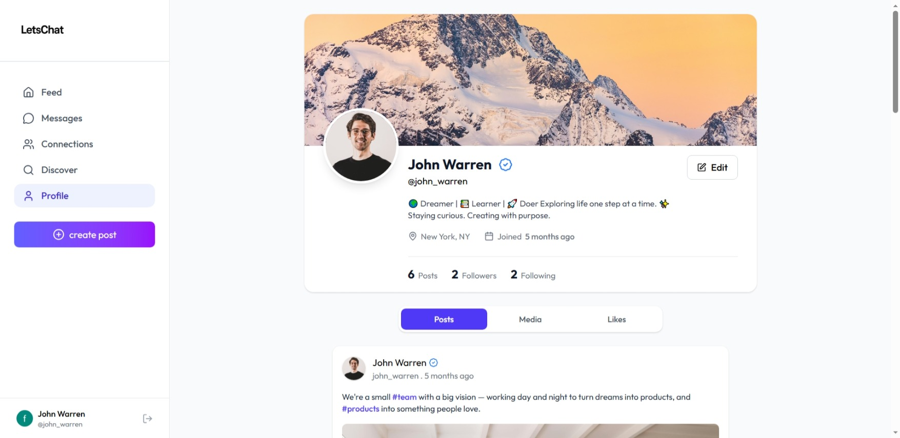
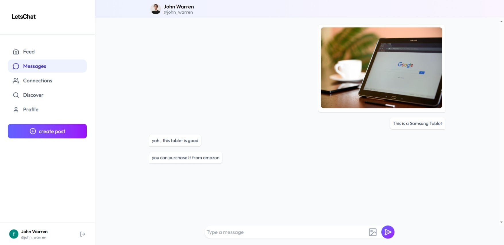

<<<<<<< HEAD
# SocialGram – Social Media Web Application

A modern, full-featured social media web application built with React.

SocialGram enables users to create posts, share stories, send messages, discover people, manage connections, and interact with their network in real time.

The application is built using React, Node.js, Express.js, MongoDB, Tailwind CSS, Cloudinary, and JWT Authentication.

---

## Live Demo

Coming Soon

---

## 📸 Screenshots

### Login / Signup


### Home Feed


### User Profile


### Chat Interface


---

## ✨ Features

### 🔐 Authentication
- Secure user registration and login
- JWT-based authentication
- Persistent login sessions
- Protected routes

### 📝 Posts
- Create text posts
- Create image posts
- Like and unlike posts
- Hashtag support
- Personalized feed

### 📖 Stories
- Upload image stories
- Story viewer interface
- Temporary story sharing

### 💬 Messaging
- One-to-one messaging
- Chat interface
- Recent conversations list

### 👥 Connections
- Discover new users
- Send connection requests
- Accept or reject requests
- Manage followers and following

### 👤 User Profiles
- Update profile information
- Upload profile picture
- Upload cover photo
- View user posts
- View followers and following

### ☁️ Media Uploads
- Cloudinary integration
- Profile image uploads
- Cover image uploads
- Post image uploads
- Story image uploads

### 📱 Responsive Design
- Mobile-friendly UI
- Tablet support
- Desktop optimized experience

---

## 🛠️ Tech Stack

### Frontend
- React.js
- Vite
- React Router DOM
- Tailwind CSS
- Lucide React
- Moment.js
- Context API

### Backend
- Node.js
- Express.js
- MongoDB
- Mongoose
- JWT Authentication
- bcryptjs
- Multer

### Cloud Services
- Cloudinary

### Deployment
- Vercel (Frontend)
- Render / Railway / VPS (Backend)

---

## 📁 Project Structure

### Frontend

```text
src
├── assets
├── components
│   ├── Loading.jsx
│   ├── MenuItem.jsx
│   ├── PostCard.jsx
│   ├── ProfileModel.jsx
│   ├── RecentMessages.jsx
│   ├── Sidebar.jsx
│   ├── StoryBar.jsx
│   ├── StoryModel.jsx
│   ├── StoryViewer.jsx
│   ├── UserCard.jsx
│   └── UserProfileInfo.jsx
├── context
│   └── AuthContext.jsx
├── pages
│   ├── ChatBox.jsx
│   ├── Connection.jsx
│   ├── CreatePost.jsx
│   ├── Discover.jsx
│   ├── Feed.jsx
│   ├── Layout.jsx
│   ├── Login.jsx
│   ├── Messages.jsx
│   └── Profile.jsx
├── App.jsx
├── main.jsx
└── index.css
```

### Backend

```text
backend
├── controllers
├── middlewares
├── models
├── routes
├── uploads
├── server.js
└── package.json
```

---

## ⚙️ Environment Variables

### Frontend (.env)

```env
VITE_API_URL=http://localhost:8000
VITE_CLOUDINARY_CLOUD_NAME=your_cloudinary_cloud_name
VITE_CLOUDINARY_UPLOAD_PRESET=your_upload_preset
```

### Backend (.env)

```env
PORT=8000
MONGODB_URI=your_mongodb_connection_string
JWT_SECRET=your_secret_key
CLIENT_URL=http://localhost:5173
```

---

## 🚀 Installation

### 1. Clone Repository

```bash
git clone https://github.com/Sahooritik/SocialGram.git
```

### 2. Enter Project Directory

```bash
cd SocialGram
```

### 3. Install Frontend Dependencies

```bash
npm install
```

### 4. Install Backend Dependencies

```bash
cd backend
npm install
```

### 5. Configure Environment Variables

Create `.env` files for both frontend and backend.

### 6. Start Backend Server

```bash
npm run server
```

### 7. Start Frontend

```bash
npm run dev
```

---

## 🔗 API Routes

### Authentication

```text
POST /api/auth/signup
POST /api/auth/login
GET  /api/auth/me
```

### Users

```text
GET /api/users/:id
PUT /api/users/update
```

### Posts

```text
POST /api/posts
GET  /api/posts/feed
GET  /api/posts/user/:userId
POST /api/posts/:postId/like
```

### Stories

```text
POST /api/stories
GET  /api/stories
```

### Messages

```text
POST /api/messages
GET  /api/messages/:userId
```

### Connections

```text
POST /api/connections/request
POST /api/connections/accept
POST /api/connections/reject
```

---

## Future Improvements

- Comments on posts
- Real-time messaging using Socket.io
- Notifications
- Video stories
- Dark mode
- Search functionality
- User blocking
- Post sharing
- Group chats

---

## Author

Ritik Sahoo

---

## License

This project is licensed under the MIT License.
=======
# socialgram_frontend
>>>>>>> 019e0ff44f8a22ffcdc0c1e353884a6ee8e083c9
